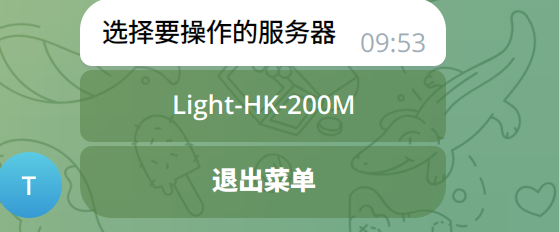
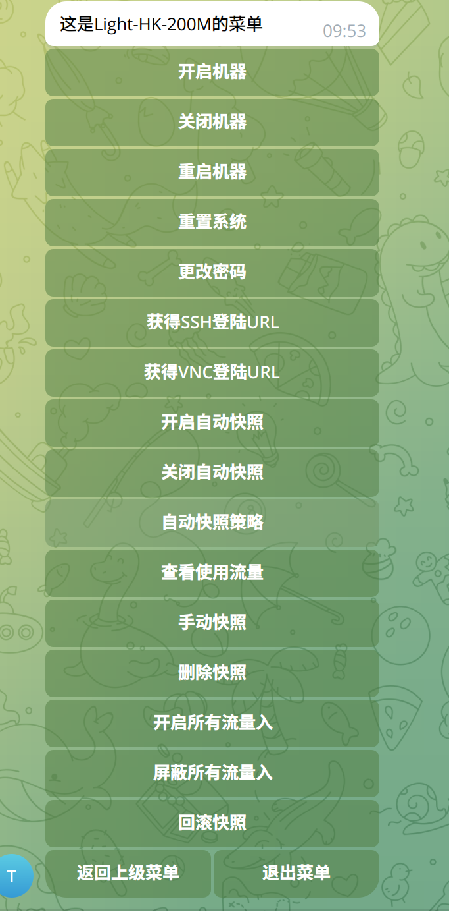

# 赞助信息

<div style="text-align: center;">
    <a href="https://www.vmiss.com/">
        
    </a>
    <a href="https://www.zovps.com/aff/VWSIBCGP">
        
    </a>
 <a href="https://yxvm.com">
        
    </a>
</div>


我们非常感谢[Vmiss](https://www.vmiss.com/)  [慈云数据](https://www.zovps.com/aff/VWSIBCGP) [Yxvm](https://yxvm.com/)提供了支持本项目所需的网络基础设施。


# 前言

通过阿里云的 AccessKeyId AccessKeySecret 管理帐号下的轻量应用服务器
用户在TG bot操作 适合上不去帐号的


# 安装部署
- 克隆项目
```shell
git clone git@github.com:betteryjs/lightweightserver.git
cd lightweightserver
```
- 复制 `config.json.exp`到 `config.json` 并填入配置信息

```shell

{
  "BaseConfig": {
    "TGBotAPI": "xxxxxx", # 填入在Botfather创建的Telegram Bot
    "chartId": "xxxx",    # 填入你的会话id 通过 @get_myidbot 获取
    "authorized_users": [
      "example"     # 授权的用户 谁可以使用这个bot 填入@后面的用户名 例如 @example 填入example
    ]
  },
  "LightConfig": [
    {
      "AccessKeyId": "xxxxxxx", # 填入阿里云AccessKeyId
      "AccessKeySecret": "xxxxxx", # 填入阿里云AccessKeyId
      "InstanceId": "xxxxxx",  # 填入阿里云轻量的实例ID
      "region_id": "cn-hongkong",  # 填入机器的地域ID 通过 https://help.aliyun.com/document_detail/40654.html 查看
      "DefaultPassword":"password",  # 填入要重置系统的密码
      "name": "Light-HK-200M",     # 填入独一无二的name 
      "SnapshotCrons": "0 3 * * *"  # 填入自动快照策略的创建时间 默认每天凌晨3点 功能还在测试 可以不开启
    },
    # 有第二个机器添加第二个机器
    {
      "AccessKeyId": "xxxxx",
      "AccessKeySecret": "xxxx",
      "InstanceId": "xxxxxx",
      "region_id": "cn-hongkong",
      "DefaultPassword":"xxxxxx",
      "name": "Light2-HK-200M",
      "SnapshotCrons": "0 3 * * *"
    }
  ]
}

```
- 安装`Python`环境
```shell
./initvenv.sh
```
- 开启或者重启服务
```shell

./restart.sh
```
- 在机器上使用 /menu 开启面板


## 卸载项目

```shell
systemctl disable LightTGBot.service
systemctl stop LightTGBot.service
rm -rf /lib/systemd/system/LightTGBot.service
rm -rf /root/lightweightserver
```
## 部署完成




# 目前实现功能
- 开启机器
> 开启服务器
- 关闭机器 
> 关闭服务器
- 重启机器 
> 重启服务器
- 重置系统
> 默认装debian11 然后通过面板的 获得SSH登陆URL 登陆就行
如果链接打不开需要手动复制链接到浏览器打开 , 重装进度可以通过获得的VNC链接查看实时进度
- 更改密码
> 更改服务器密码 密码就是在 DefaultPassword 参数里设置的
- 获得SSH登陆URL 
> 获得SSH登陆URL  URL就是阿里官方的那个登陆SSH的终端
- 获得VNC登陆URL 
> 获得VNC登陆URL  URL就是阿里官方的那个登陆VNC的终端
- 开启自动快照 
> 开启自动快照策略 默认关闭 还在测试
- 关闭自动快照 
- 自动快照策略状态 
- 查看使用流量 
- 手动快照
- 删除快照
- 开启所有流量入
- 屏蔽所有流量入
- 回滚快照
